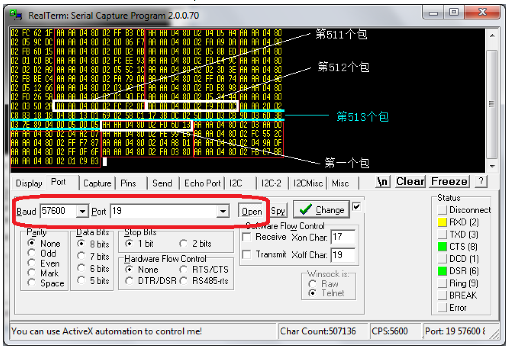

# Outline

1. [Prepare](#Prepare) 
2. [TGAM Specification](#TGAM-Specification)
    - [General](#General)
    - [I/O pins](#(I/O-pins))
    - [Serial Communication](#(Serial-Communication))
        - [ThinkGear CODE](#(ThinkGear-CODE))
        - [Command bytes](#(Command-bytes))
    - [Configurable Default Settings](#(Configurable-Default-Settings))
    - [Mechanical Drawing](#(Mechanical-Drawing))
3. [TGAM Communication Protocol](#(TGAM-Communication-Protocol))
    - [Introduction](#Introduction)
    - [Bluetooth Interface](#(Bluetooth-Interface))
    - [ThinkGear Data Values](#(ThinkGear-Data-Values))
        - [POOR_SIGNAL Quality](#(POOR_SIGNAL-Quality))
        - [eSense™ Meters](#(eSense™-Meters))
        - [ATTENTION eSense](#(ATTENTION-eSense))
        - [MEDITATION eSense](#(MEDITATION-eSense))
        - [RAW Wave Value (16-bit)](#(RAW-Wave-Value-(16-bit)))
        - [ASIC_EEG_POWER](#ASIC_EEG_POWER)
        - [Blink Strength](#(Blink-Strength))
    - [ThinkGear Packets](#(ThinkGear-Packets))
        - [Packet Structure](#(Packet-Structure))
        - [Packet Header](#(Packet-Header))
        - [Data Payload](#(Data-Payload))
        - [Payload Checksum](#(Payload-Checksum))
        - [Data Payload Structure](#(Data-Payload-Structure))
        - [DataRow Format](#(DataRow-Format))
            - [CODE Definitions Table](#(CODE-Definitions-Table))
    - [Example Packet](#(Example-Packet))
        - [Step-By-Step Guide to Parsing a Packet](#(Step-By-Step-Guide-to-Parsing-a-Packet))
        - [Step-By-Step Guide to Parsing DataRows in a Packet Payload](#(Step-By-Step-Guide-to-Parsing-DataRows-in-a-Packet-Payload))
        - [Sample C Code for Parsing a Packet](#(Sample-C-Code-for-Parsing-a-Packet))
        - [ThinkGearStreamParser C API](#(ThinkGearStreamParser-C-API))
4. [Connecting](#Connecting)
5. [Data](#Data)
    - [小包](#(小包))
    - [关于眨眼](#(关于眨眼))
6. [MindViewer](#MindViewer)
    - [Build](#Build)
    - [Version](#Version)

# Prepare

TGAM模块一个

蓝牙模块一个（必须，否则无法获取数据）

# TGAM specification

The MindSet transmits ThinkGear Data Values, encoded within inkGear Packets, as a serial stream
of bytes over Bluetooth via a standard Bluetooth Serial Port Proíle (SPP):
• Bluetooth Profile: Serial Port Profile (SPP)
• Baud Rate: 57600
• Authentication key: 0000
Please refer to the MindSet Quick Start Guide and/or MindSet Instruction Manual that accompanied
your MindSet for instructions on how to pair the MindSet to your Windows or Mac computer via
SPP using Bluetooth drivers and Bluetooth stacks available for those platforms. For information on
pairing the MindSet via SPP on other platforms, please refer to your platform's documentation, and
to the SPP specifications that can be found on the Web.

## General 


| Classification | Specification | Notes|
|-------------------- | ------------------ | ---------|
| Product Family | ThinkGear-AM | A = ASIC, M = Module |
| Model Number | TGAM1 |
| Revision Number | 2.4  | Also can be used for 2.3 |
| Module Dimension (Max) | 27.9mm x 15.2mm x 2.5mm | 1.10in x 0.60in x 0.10in <br> (L x W x H) |
| Module Weight (Max) | 130mg | 0.0045 ounces |
| Operating Voltage | 2.97V ~ 3.63V  | Stuff Option* <br>SP6200 3.0~6.0V <br> MAX1595 1.8~5.5V|
| Max Input Voltage Noise | 10mV Peak to Peak |
| Max Power Consumption | 15mA @ 3.3V
| ESD Protection | 4kV Contact Discharge <br> 8kV Air Discharge | Tested at EEG, REF,GND|
| Output Interface Standard | UART(Serial) | TX, RX, VCC(+), GND(-) |
| Output Baud Rate | 1200, 9600, 57600 | Default set with stuff option|
| #EEG Channels | 1 | 3 contacts (EEG, REF, GND)|

***Check with NeuroSky Sales for price addition.***

## I/O pins 


Header P1 (Electrode)

Pin1: EEG Electrode "EEG"

Pin2: EEG Shield

Pin3: Ground Electrode

Pin4: Reference Shield

Pin5: Reference Electrode "REF"

Header P4 (Power)

Pin1: VCC "+"

Pin2: GND "-"

Header P3 (UART/Serial)

Pin1: GND "-"

Pin2: VCC "+"

Pin3: RXD "R"

Pin4: TXD "T"

Note: Labels in "" indicated on PCB for convenience.

## Serial Communication

This section only outlines parts that are different from the standard ThinkGear API. Please refer to the ThinkGear API and Reference Manual for more details.


### ThinkGear CODE

The code that may appear in the inkGear packets are listed in the following table.

| Code | Length | Value | Default Setting |
| ------- | ----------- | -------- | ---------------------- |
| 0x02 | N/A | Poor Quality (0-200) | On |
| 0x04 | N/A | eSense Attention (0-100) | On |
| 0x05 | N/A | eSense Meditation (0-100) | On |
| 0x80 | 2 | 12-bit Raw EEG | Off |
| 0x83 |24 | EEG Powers (integer) | On |

### Command bytes

The command bytes supported by TGAM1 is listed below.
Page 0 (0000____) (0x0_): STANDARD/ASIC CONFIG COMMANDS* **
00000000 (0x00): 9600 baud, normal output mode
00000001 (0x01): 1200 baud, normal output mode
00000010 (0x02): 57.6k baud, normal+raw output mode

## Configurable Default Settings

TGAM1 has configuration pads that can be used to change two default settings that are applied at chip power up. The configuration pads are located on the backside of the TGAM1, as indicated by the red and blue box in Figure 3.1. The BR0 and BR1 pads configure the output baud rate and data content, after the TGAM1 powers up. The M pad configures the notch filter frequency


Figure 3.1: TGAM1's Configuration Pads


|BR1 | BR0 | Function|
|-----  | -------| ------------|
|GND | GND | 9600 Baud with Normal* Output Mode |
|GND | VCC | 1200 Baud with Normal* Output Mode |
|VCC | GND |57.6k Baud with Normal* + Raw Output Mode|
|VCC |VCC |N/A|

***Normal Output mode includes the following output: poor quality value, EEG value, Attention value and
Meditation value.***

A magnified picture of the B1 and B0 pads are shown in Figure 3.2. The first row of pads are GND and
third row of pads are VCC. The TGAM1 output baud rate and data content after power up behavior depends on the pad setting as described in table above. For example, the stuff option in the module in Figure 3.1 has both BR1 and BR0 tie to GND pads for a 9600 baud with Normal Output Mode.


The baud rate can also be configured after the module is powered up by sending commands through the UART interface. The commands are listed in the table below. When the module is reset, the baud rate setting will revert back to the default set by BR0 and BR1.


| Command | Function |
| --------------- | ------------  |
| 0x00 |9600 Baud with Normal* Output Mode |
| 0x01 |1200 Baud with Normal* Output Mode |
| 0x02 | 57.6k Baud with Normal* + Raw Output Mode |


***Normal Output mode includes the following output: poor quality value, EEG value, Attention value and Meditation value.***


As mentioned earlier, TGAM1’s notch filter frequency can be configured with the M configuration pads. It is used to select either 50Hz or 60Hz to reduce the AC noise speciëc to a targeted market. As indicated in Figure 3.3, the top pad is GND and bottom pad is VCC. Tie the M pad to VCC pad to select 60Hz, and to GND pad to select 50Hz notch filtering frequency. Unlike the BR0, BR1 configuration, there is no equivalent software configuration for the M configuration. The most common stuff option for these configuration pads are illustrated in Figure 3.1, configuring the TGAM1 for 9600 Baud, normal output and 60Hz notch filtering frequency. For other stuffing options, contact NeuroSky Sales to get the correct ordering code.


## Mechanical Drawing 

The dimensions and major components of the TGAM1 is shown in the mechanical drawing in Figure 4.1. There are two mounting holes at the upper right and lower left corner. They can be used to secure the TGAM1 to your system housing.


Figure 4.1: Mechanical Drawing & Thickness

# TGAM Communication Protocol

## Introduction
ThinkGear™ is the technology inside every NeuroSky product or partner product that enables a device
to interface with the user's brainwaves. ThinkGear includes the sensor that touches the forehead, the
contact and reference points located on the ear pad, and the onboard chip that processes all of the data
and provides this data to software and applications in digital form. Both the raw brainwaves and the
eSense Meters (Attention and Meditation) are calculated on the ThinkGear chip.
The MindSet™ headset incorporatesThinkGear technology in a convenient, stylish headset form factor,
complete with Bluetooth audio and microphone.
This MindSet Communications Protocol document defines, in detail, how to communicate with the
MindSet. In particular, it describes:
• How to connect to the Bluetooth serial data stream to receive a stream of bytes.
• How to parse the serial data stream of bytes to reconstruct the various types of brainwave data
sent by the MindSet
• How to interpret and use the various types of brainwave data that are sent from the ThinkGear
(including Attention, Meditation, and signal quality data) in a BCI application
TheThinkGear Data Values chapter defines the types of Data Values that can be reported byThinkGear
in a MindSet. It is highly recommended that you read this section to familiarize yourself with which
kinds of Data Values are (and aren't) available from MindSet before continuing to later chapters.
The ThinkGear Packets chapter describes the ThinkGear Packet format used to deliver the ThinkGear
Data Values over the serial I/O stream.


## Bluetooth Interface
The MindSet transmits ThinkGear Data Values, encoded within ThinkGear Packets, as a serial stream
of bytes over Bluetooth via a standard Bluetooth Serial Port Proíle (SPP):
• Bluetooth Profile: Serial Port Profile (SPP)
• Baud Rate: 57600
• Authentication key: 0000
Please refer to the MindSet Quick Start Guide and/or MindSet Instruction Manual that accompanied
your MindSet for instructions on how to pair the MindSet to your Windows or Mac computer via
SPP using Bluetooth drivers and Bluetooth stacks available for those platforms. For information on
pairing the MindSet via SPP on other platforms, please refer to your platform's documentation, and
to the SPP specifications that can be found on the Web.

## ThinkGear Data Values

### POOR_SIGNAL Quality
This unsigned one-byte integer value describes how poor the signal measured by the ThinkGear is. It
ranges in value from 0 to 200. Any non-zero value indicates that some sort of noise contamination is
detected. The higher the number, the more noise is detected. A value of 200 has a special meaning,
specifically that the ThinkGear contacts are not touching the user's skin.
This value is typically output every second, and indicates the poorness of the most recent measure-
ments.
Poor signal may be caused by a number of different things. In order of severity, they are:
• Sensor, ground, or reference contacts not being on a person's head (i.e. when nobody is wearing
the ThinkGear).
• Poor contact of the sensor, ground, or reference contacts to a person's skin (i.e. hair in the way,
or headset which does not properly fit a person's head, or headset not properly placed on the
head).
• Excessive motion of the wearer (i.e. moving head or body excessively, jostling the headset).
• Excessive environmental electrostatic noise (some environments have strong electric signals or
static electricity buildup in the person wearing the sensor).
• Excessive non-EEG biometric noise (i.e. EMG, EKG/ECG, EOG, etc)
A certain amount of noise is unavoidable in normal usage of ThinkGear, and both NeuroSky's filter-
ing technology and eSense™ algorithm have been designed to detect, correct, compensate for, account
for, and tolerate many types of non-EEG noise. Most typical users who are only interested in us-
ing the eSense values, such as Attention and Meditation, do not need to worry too much about the
POOR_SIGNAL Quality value, except to note that the Attention and Meditation values will not be
updated while POOR_SIGNAL is detected. The POOR_SIGNAL Quality value is more useful to some
applications which need to be more sensitive to noise (such as some medical or research applications),
or applications which need to know right away when there is even minor noise detected.
By default, output of this Data Value is enabled. It is typically output once a second.

### eSense™ Meters

For all the different types of eSenses (i.e. Attention, Meditation), the meter value is reported on a
relative eSense scale of 1 to 100. On this scale, a value between 40 to 60 at any given moment in time
is considered "neutral", and is similar in notion to "baselines" that are established in conventional EEG
measurement techniques (though the method for determining a ThinkGear baseline is proprietary and
may differ from conventional EEG). A value from 60 to 80 is considered "slightly elevated", and may
be interpreted as levels being possibly higher than normal (levels of Attention or Meditation that may
be higher than normal for a given person). Values from 80 to 100 are considered "elevated", meaning
they are strongly indicative of heightened levels of that eSense.
Similarly, on the other end of the scale, a value between 20 to 40 indicates "reduced" levels of the
eSense, while a value between 1 to 20 indicates "strongly lowered" levels of the eSense. These levels
may indicate states of distraction, agitation, or abnormality, according to the opposite of each eSense.
An eSense meter value of 0 is a special value indicating the ThinkGear is unable to calculate an eSense
level with a reasonable amount of reliability. This may be (and usually is) due to excessive noise as
described in the POOR_SIGNAL Quality section above.
The reason for the somewhat wide ranges for each interpretation is that some parts of the eSense
algorithm are dynamically learning, and at times employ some "slow-adaptive" algorithms to adjust
to natural ìuctuations and trends of each user, accounting for and compensating for the fact that
EEG in the human brain is subject to normal ranges of variance and ìuctuation. This is part of the
reason why ThinkGear sensors are able to operate on a wide range of individuals under an extremely
wide range of personal and environmental conditions while still giving good accuracy and reliability.
Developers are encouraged to further interpret and adapt these guideline ranges to be fine-tuned for
their application (as one example, an application could disregard values below 60 and only react to
values between 60-100, interpreting them as the onset of heightened attention levels).

### ATTENTION eSense

This unsigned one-byte value reports the current eSense Attention meter of the user, which indi-
cates the intensity of a user's level of mental "focus" or "attention", such as that which occurs during
intense concentration and directed (but stable) mental activity. Its value ranges from 0 to 100. Dis-
tractions, wandering thoughts, lack of focus, or anxiety may lower the Attention meter levels. See
eSense\texttrademark Meters above for details about interpreting eSense levels in general.
By default, output of this Data Value is enabled. It is typically output once a second.

### MEDITATION eSense

This unsigned one-byte value reports the current eSense Meditation meter of the user, which indicates
the level of a user's mental "calmness" or "relaxation". Its value ranges from 0 to 100. Note that
Meditation is a measure of a person's mental levels, not physical levels, so simply relaxing all the
muscles of the body may not immediately result in a heightened Meditation level. However, for
most people in most normal circumstances, relaxing the body often helps the mind to relax as well.
Meditation is related to reduced activity by the active mental processes in the brain, and it has long
been an observed effect that closing one's eyes turns off the mental activities which process images
from the eyes, so closing the eyes is often an effective method for increasing the Meditation meter level.
Distractions, wandering thoughts, anxiety, agitation, and sensory stimuli may lower the Meditation
meter levels. See "eSense Meters" above for details about interpreting eSense levels in general.
By default, output of this Data Value is enabled. It is typically output once a second.

### RAW Wave Value (16-bit)

This Data Value consists of two bytes, and represents a single raw wave sample. Its value is a signed
16-bit integer that ranges from -32768 to 32767. The first byte of the Value represents the high-order
bits of the twos-compliment value, while the second byte represents the low-order bits. To reconstruct
the full raw wave value, simply shift the first byte left by 8 bits, and bitwise-or with the second byte:
RAW Wave Value (16-bit)

short raw = (Value[0]<<8) | Value[1];
where Value[0] is the high-order byte, and Value[1] is the low-order byte.
In systems or languages where bit operations are inconvenient, the following arithmetic operations
may be substituted instead:
raw = Value[0]*256 + Value[1];
if( raw >= 32768 ) raw = raw - 65536;
where raw is of any signed number type in the language that can represent all the numbers from
-32768 to 32767.
Each ThinkGear model reports its raw wave information in only certain areas of the full -32768 to
32767 range. For example, MindSet reports raw waves that fall between approximately -2048 to 2047.
By default, output of this Data Value is enabled, and is outputed 512 times a second, or approximately
once every 2ms.

### ASIC_EEG_POWER

This Data Value represents the current magnitude of 8 commonly-recognized types of EEG (brain-
waves). This Data Value is output as a series of eight 3-byte unsigned integers in little-endian for-
mat. The eight EEG powers are output in the following order: delta (0.5 - 2.75Hz), theta (3.5 -
6.75Hz), low-alpha (7.5 - 9.25Hz), high-alpha (10 - 11.75Hz), low-beta (13 - 16.75Hz), high-beta
(18 - 29.75Hz), low-gamma (31 - 39.75Hz), and mid-gamma (41 - 49.75Hz). These values have no
units and therefore are only meaningful compared to each other and to themselves, to consider relative
quantity and temporal ìuctuations.
By default, output of this Data Value is enabled, and is typically output once a second.

### Blink Strength

This unsigned one byte value reports the intensity of the user's most recent eye blink. Its value ranges
from 1 to 255 and it is reported whenever an eye blink is detected. The value indicates the relative
intensity of the blink, and has no units.
Note: This data value is currently only available via the TGCD and TGC APIs. It is
not directly available as output from any current ThinkGear hardware. For TGCD, see the
TG_DATA_BLINK_STRENGTH data type for use with the TG_GetValueStatus() and TG_GetValue()
functions.

## ThinkGear Packets

ThinkGear components deliver their digital data as an asynchronous serial stream of bytes. The serial
stream must be parsed and interpreted as ThinkGear Packets in order to properly extract and interpret
the ThinkGear Data Values described in the chapter above.
A ThinkGear Packet is a packet format consisting of 3 parts:
1. Packet Header
2. Packet Payload
3. Payload Checksum
ThinkGear Packets are used to deliver Data Values (described in the previous chapter) from aThinkGear
module to an arbitrary receiver (a PC, another microprocessor, or any other device that can receive a
serial stream of bytes). Since serial I/O programming APIs are different on every platform, operating
system, and language, it is outside the scope of this document (see your platform's documentation for
serial I/O programming). This chapter will only cover how to interpret the serial stream of bytes into
ThinkGear Packets, Payloads, and finally into the meaningful Data Values described in the previous
chapter.
The Packet format is designed primarily to be robust and ìexible: Combined, the Header and Check-
sum provide data stream synchronization and data integrity checks, while the format of the Data
Payload ensures that new data fields can be added to (or existing data fields removed from) the Packet
in the future without breaking any Packet parsers in any existing applications/devices. This means that
any application that implements a ThinkGear Packet parser properly will be able to use newer models
of ThinkGear modules most likely without having to change their parsers or application at all, even if
the newer ThinkGear hardware includes new data fields or rearranges the order of the data fields.

### Packet Structure

Packets are sent as an asynchronous serial stream of bytes. The transport medium may be UART, serial
COM, USB, bluetooth, file, or any other mechanism which can stream bytes.
Each Packet begins with its Header, followed by its Data Payload, and ends with the Payload's Check-
sum Byte, as follows:
[SYNC] [SYNC] [PLENGTH] [PAYLOAD...] [CHKSUM]
_______________________ _____________ ____________
^^^^^^^^(Header)^^^^^^^ ^^(Payload)^^ ^(Checksum)^
The [PAYLOAD…] section is allowed to be up to 169 bytes long, while each of [SYNC], [PLENGTH],
and [CHKSUM] are a single byte each. This means that a complete, valid Packet is a minimum of 4
bytes long (possible if the Data Payload is zero bytes long, i.e. empty) and a maximum of 173 bytes
long (possible if the Data Payload is the maximum 169 bytes long).
A procedure for properly parsing ThinkGear Packets is given below in Step-By-Step Guide to Parsing
a Packet.

### Packet Header

The Header of a Packet consists of 3 bytes: two synchronization [SYNC] bytes (0xAA 0xAA), followed
by a [PLENGTH] (Payload length) byte:
[SYNC] [SYNC] [PLENGTH]
_______________________
^^^^^^^^(Header)^^^^^^^
The two [SYNC] bytes are used to signal the beginning of a new arriving Packet and are bytes with
the value 0xAA (decimal 170). Synchronization is two bytes long, instead of only one, to reduce the
chance that [SYNC] (0xAA) bytes occurring within the Packet could be mistaken for the beginning
of a Packet. Although it is still possible for two consecutive [SYNC] bytes to appear within a Packet
(leading to a parser attempting to begin parsing the middle of a Packet as the beginning of a Packet) the
[PLENGTH] and [CHKSUM] combined ensure that such a "mis-sync'd Packet" will never be accidentally
interpreted as a valid packet (see Payload Checksum below for more details).
The [PLENGTH] byte indicates the length, in bytes, of the Packet's Data Payload [PAYLOAD…] section,
and may be any value from 0 up to 169. Any higher value indicates an error (PLENGTH TOO LARGE).
Be sure to note that [PLENGTH] is the length of the Packet's Data Payload, NOT of the entire Packet.
The Packet's complete length will always be [PLENGTH] + 4.

### Data Payload

The Data Payload of a Packet is simply a series of bytes. The number of Data Payload bytes in the
Packet is given by the [PLENGTH] byte from the Packet Header. The interpretation of the Data Pay-
load bytes into the ThinkGear Data Values described in Chapter 1 is defined in detail in the Data
Payload Structure section below. Note that parsing of the Data Payload typically should not even be
attempted until after the Payload Checksum Byte [CHKSUM] is verified as described in the following
section.

### Payload Checksum

The [CHKSUM] Byte must be used to verify the integrity of the Packet's Data Payload. The Payload's
Checksum is defined as:
1. summing all the bytes of the Packet's Data Payload
2. taking the lowest 8 bits of the sum
3. performing the bit inverse (one's compliment inverse) on those lowest 8 bits
A receiver receiving a Packet must use those 3 steps to calculate the checksum for the Data Payload
they received, and then compare it to the [CHKSUM] Checksum Byte received with the Packet. If the
calculated payload checksum and received [CHKSUM] values do not match, the entire Packet should
be discarded as invalid. If they do match, then the receiver may procede to parse the Data Payload as
described in the "Data Payload Structure" section below.
Packet Structure

### Data Payload Structure

Once the Checksum of a Packet has been verified, the bytes of the Data Payload can be parsed. The
Data Payload itself consists of a continuous series of Data Values, each contained in a series of bytes
called a DataRow. Each DataRow contains information about what the Data Value represents, the
length of the Data Value, and the bytes of the Data Value itself. Therefore, to parse a Data Payload,
one must parse each DataRow from the Data Payload, until all bytes of the Data Payload have been
parsed.

### DataRow Format

A DataRow consists of bytes in the following format:
([EXCODE]...) [CODE] ([VLENGTH]) [VALUE...]
____________________ ____________ ___________
^^^^(Value Type)^^^^ ^^(length)^^ ^^(value)^^
Note: Bytes in parentheses are conditional, meaning that they only appear in some DataRows, and
not in others. See the following description for details.
The DataRow may begin with zero or more [EXCODE] (Extended Code) bytes, which are bytes with
the value 0x55. The number of [EXCODE] bytes indicates the Extended Code Level. The Extended
Code Level, in turn, is used in conjuction with the [CODE] byte to determine what type of Data
Value this DataRow contains. Parsers should therefore always begin parsing a DataRow by counting
the number of [EXCODE] (0x55) bytes that appear to determine the Extended Code Level of the
DataRow's [CODE].
The [CODE] byte, in conjunction with the Extended Code Level, indicates the type of Data Value
encoded in the DataRow. For example, at Extended Code Level 0, a [CODE] of 0x04 indicates that
the DataRow contains an eSense Attention value. For a list of defined [CODE] meanings, see the
CODE Definitions Table below. Note that the [EXCODE] byte of 0x55 will never be used as a [CODE]
(incidentally, the [SYNC] byte of 0xAA will never be used as a [CODE] either).
If the [CODE] byte is between 0x00 and 0x7F, then the the [VALUE…] is implied to be 1 byte long
(referred to as a Single-Byte Value). In this case, there is no [VLENGTH] byte, so the single [VALUE]
byte will appear immediately after the [CODE] byte.
If, however, the [CODE] is greater than 0x7F, then a [VLENGTH] ("Value Length") byte immediately
follows the [CODE] byte, and this is the number of bytes in [VALUE…] (referred to as a Multi-Byte
Value). These higher CODEs are useful for transmitting arrays of values, or values that cannot be fit
into a single byte.
The DataRow format is defined in this way so that any properly implemented parser will not break
in the future if new CODEs representing arbitrarily long DATA… values are added (they simply ignore
unrecognized CODEs, but do not break in parsing), the order of CODEs is rearranged in the Packet, or
if some CODEs are not always transmitted in every Packet.
A procedure for properly parsing Packets and DataRows is given below in Step-By-Step Guide to
Parsing a Packet and Step-By-Step Guide to Parsing DataRows in a Packet Payload, respectively.

#### CODE Definitions Table

Single-Byte CODEs
Extended (Byte)
Code Level [CODE] [LENGTH] Data Value Meaning
---------- ------ -------- ------------------
0 0x02 - POOR_SIGNAL Quality (0-255)
0 0x04 - ATTENTION eSense (0 to 100)
0 0x05 - MEDITATION eSense (0 to 100)
0 0x16 - Blink Strength. (0-255) Sent only
when Blink event occurs.
Multi-Byte CODEs
Extended (Byte)
Code Level [CODE] [LENGTH] Data Value Meaning
---------- ------ -------- ------------------
0 0x80 2 RAW Wave Value: a single big-endian
16-bit two's-compliment signed value
(high-order byte followed by
low-order byte) (-32768 to 32767)
0 0x83 24 ASIC_EEG_POWER: eight big-endian
3-byte unsigned integer values
representing delta, theta, low-alpha
high-alpha, low-beta, high-beta,
low-gamma, and mid-gamma EEG band
power values
Any 0x55 - NEVER USED (reserved for [EXCODE])
Any 0xAA - NEVER USED (reserved for [SYNC])
(any Extended Code Level/CODE combinations not listed in the table above have not yet been defined,
but may be added at any time in the future)
For detailed explanations of the meanings of each type of Data Value, please refer to the chapter on
ThinkGear Data Values.

## Example Packet

The following is a typical packet. Aside from the [SYNC], [PLENGTH], and [CHKSUM] bytes, all the
other bytes (bytes [ 3] to [34]) are part of the Packet's Data Payload. Note that the DataRows
within the Payload are not guaranteed to appear in every Packet, nor are any DataRows that do appear
guaranteed by the Packet specification to appear in any particular order.
byte: value // [CODE] Explanation

[ 0]: 0xAA // [SYNC]

[ 1]: 0xAA // [SYNC]

[ 2]: 0x20 // [PLENGTH] (payload length) of 32 bytes

[ 3]: 0x02 // [POOR_SIGNAL] Quality

[ 4]: 0x00 // No poor signal detected (0/200)

[ 5]: 0x83 // [ASIC_EEG_POWER_INT]

[ 6]: 0x18 // [VLENGTH] 24 bytes

[ 7]: 0x00 // (1/3) Begin Delta bytes

[ 8]: 0x00 // (2/3)

[ 9]: 0x94 // (3/3) End Delta bytes

[10]: 0x00 // (1/3) Begin Theta bytes

[11]: 0x00 // (2/3)

[12]: 0x42 // (3/3) End Theta bytes

[13]: 0x00 // (1/3) Begin Low-alpha bytes

[14]: 0x00 // (2/3)

[15]: 0x0B // (3/3) End Low-alpha bytes

[16]: 0x00 // (1/3) Begin High-alpha bytes

[17]: 0x00 // (2/3)

[18]: 0x64 // (3/3) End High-alpha bytes

[19]: 0x00 // (1/3) Begin Low-beta bytes

[20]: 0x00 // (2/3)

[21]: 0x4D // (3/3) End Low-beta bytes

[22]: 0x00 // (1/3) Begin High-beta bytes

[23]: 0x00 // (2/3)

[24]: 0x3D // (3/3) End High-beta bytes

[25]: 0x00 // (1/3) Begin Low-gamma bytes

[26]: 0x00 // (2/3)

[27]: 0x07 // (3/3) End Low-gamma bytes

[28]: 0x00 // (1/3) Begin Mid-gamma bytes

[29]: 0x00 // (2/3)

[30]: 0x05 // (3/3) End Mid-gamma bytes

[31]: 0x04 // [ATTENTION] eSense

[32]: 0x0D // eSense Attention level of 13

[33]: 0x05 // [MEDITATION] eSense

[34]: 0x3D // eSense Meditation level of 61

[35]: 0x34 // [CHKSUM] (1's comp inverse of 8-bit Payload sum of 0xCB)
### Step-By-Step Guide to Parsing a Packet
1. Keep reading bytes from the stream until a [SYNC] byte (0xAA) is encountered.
2. Read the next byte and ensure it is also a [SYNC] byte
• If not a [SYNC] byte, return to step 1.
• Otherwise, continue to step 3.
3. Read the next byte from the stream as the [PLENGTH].
• If [PLENGTH] is 170 ([SYNC]), then repeat step 3.
• If [PLENGTH] is greater than 170, then return to step 1 (PLENGTH TOO LARGE).
• Otherwise, continue to step 4.
4. Read the next [PLENGTH] bytes of the [PAYLOAD…] from the stream, saving them into a storage
area (such as an unsigned char payload[256] array). Sum up each byte as it is read by
incrementing a checksum accumulator (checksum += byte).
5. Take the lowest 8 bits of the checksum accumulator and invert them. Here is the C code:
checksum &= 0xFF;
checksum = ~checksum & 0xFF;

6. Read the next byte from the stream as the[CHKSUM] byte.
• If the [CHKSUM] does not match your calculated chksum (CHKSUM FAILED).
• Otherwise, you may now parse the contents of the Payload into DataRows to obtain the
Data Values, as described below.
• In either case, return to step 1.
### Step-By-Step Guide to Parsing DataRows in a Packet Payload
Repeat the following steps for parsing a DataRow until all bytes in the payload[] array ([PLENGTH]
bytes) have been considered and parsed:
1. Parse and count the number of [EXCODE] (0x55) bytes that may be at the beginning of the
current DataRow.
2. Parse the [CODE] byte for the current DataRow.
3. If [CODE] >= 0x80, parse the next byte as the [VLENGTH] byte for the current DataRow.
4. Parse and handle the [VALUE…] byte(s) of the current DataRow, based on the DataRow's [EX-
CODE] level, [CODE], and [VLENGTH] (refer to the Code Definitions Table).
5. If not all bytes have been parsed from the payload[] array, return to step 1. to continue parsing
the next DataRow.
### Sample C Code for Parsing a Packet
The following is an example of a program, implemented in C, which reads from a stream and (correctly)
parses Packets continuously. Search for the word TODO for the two sections which would need to
be modified to be appropriate for your application.
Note: For simplicity, error checking and handling for standard library function calls have been omit-
ted. A real application should probably detect and handle all errors gracefully.
```
#include <stdio.h>
#define SYNC 0xAA
#define EXCODE 0x55
int parsePayload( unsigned char *payload, unsigned char pLength ) {
unsigned char bytesParsed = 0;
unsigned char code;
unsigned char length;
unsigned char extendedCodeLevel;
int i;
/* Loop until all bytes are parsed from the payload[] array... */
while( bytesParsed < pLength ) {
    /* Parse the extendedCodeLevel, code, and length */
    extendedCodeLevel = 0;
    while( payload[bytesParsed] == EXCODE ) {
        extendedCodeLevel++;
        bytesParsed++;
    }
    code = payload[bytesParsed++];
    if( code & 0x80 ) length = payload[bytesParsed++];
    else length = 1;
    /* TODO: Based on the extendedCodeLevel, code, length,
     * and the [CODE] Definitions Table, handle the next
     * "length" bytes of data from the payload as
     * appropriate for your application.
     */
    printf( "EXCODE level: %d CODE: 0x%02X length: %d\n",
    extendedCodeLevel, code, length );
    printf( "Data value(s):" );
    for( i=0; i<length; i++ ) {
        printf( " %02X", payload[bytesParsed+i] & 0xFF );
    }
    printf( "\n" );
    /* Increment the bytesParsed by the length of the Data Value */
    bytesParsed += length;
}
   return( 0 );
}

int main( int argc, char **argv ) 
{
    int checksum;
    unsigned char payload[256];
    unsigned char pLength;
    unsigned char c;
    unsigned char i;
/* TODO: Initialize 'stream' here to read from a serial data
* stream, or whatever stream source is appropriate for your
* application. See documentation for "Serial I/O" for your
* platform for details.
*/
FILE *stream = 0;
stream = fopen( "COM4", "r" );
/* Loop forever, parsing one Packet per loop... */
while( 1 ) {
/* Synchronize on [SYNC] bytes */
fread( &c, 1, 1, stream );
if( c != SYNC ) continue;
fread( &c, 1, 1, stream );
if( c != SYNC ) continue;
/* Parse [PLENGTH] byte */
while( true ) {
fread( &pLength, 1, 1, stream );
if( pLength ~= 170 ) break;
}
if( pLength > 169 ) continue;
/* Collect [PAYLOAD...] bytes */
fread( payload, 1, pLength, stream );
/* Calculate [PAYLOAD...] checksum */
checksum = 0;
for( i=0; i<pLength; i++ ) checksum += payload[i];
checksum &= 0xFF;
checksum = ~checksum & 0xFF;
/* Parse [CKSUM] byte */
fread( &c, 1, 1, stream );
/* Verify [CKSUM] byte against calculated [PAYLOAD...] checksum */
if( c != checksum ) continue;
/* Since [CKSUM] is OK, parse the Data Payload */
parsePayload( payload, pLength );
}
return( 0 );
}
```

### ThinkGearStreamParser C API

The ThinkGearStreamParser API is a library which implements the parsing procedure described above
and abstracts it into two simple functions, so that the programmer does not need to worry about
parsing Packets and DataRows at all. All that is left is for the programmer to get the bytes from the
data stream, stuff them into the parser, and then define what their program does with the Value[]
bytes from each DataRow that is received and parsed.
The source code for the ThinkGearStreamParser API is provided as part of the MindSet Development
Tools (MDT), and consists of a .h header file and a .c source file. It is implemented in pure ANSI C
for maximum portability to all platforms (including microprocessors).
Using the API consists of 3 steps:
1. Define a data handler (callback) function which handles (acts upon) Data Values as they're
received and parsed.
2. Initialize a ThinkGearStreamParser struct by calling the THINKGEAR_initParser() func-
tion.
3. As each byte is received from the data stream, the program passes it to the THINKGEAR_parseByte()
function. This function will automatically call the data handler function defined in 1) whenever
a Data Value is parsed.
The following subsections are excerpts from the ThinkGearStreamParser.h header file, which serves
as the API documentation.

Constants
```
/* Parser types */
#define PARSER_TYPE_NULL 0x00
#define PARSER_TYPE_PACKETS 0x01 /* Stream bytes as ThinkGear Packets */
#define PARSER_TYPE_2BYTERAW 0x02 /* Stream bytes as 2-byte raw data */
/* Data CODE definitions */
#define PARSER_BATTERY_CODE 0x01
#define PARSER_POOR_SIGNAL_CODE 0x02
#define PARSER_ATTENTION_CODE 0x04
#define PARSER_MEDITATION_CODE 0x05
#define PARSER_RAW_CODE 0x80
THINKGEAR_initParser()
/**
* @param parser Pointer to a ThinkGearStreamParser object.
* @param parserType One of the PARSER_TYPE_* constants defined
* above: PARSER_TYPE_PACKETS or
* PARSER_TYPE_2BYTERAW.
* @param handleDataValueFunc A user-defined callback function that will
* be called whenever a data value is parsed
* from a Packet.
* @param customData A pointer to any arbitrary data that will
* also be passed to the handleDataValueFunc
* whenever a data value is parsed from a
* Packet.
*
* @return -1 if @c parser is NULL.
* @return -2 if @c parserType is invalid.
* @return 0 on success.
*/
int
THINKGEAR_initParser( ThinkGearStreamParser *parser, unsigned char parserType,
void (*handleDataValueFunc)(
unsigned char extendedCodeLevel,
unsigned char code, unsigned char numBytes,
const unsigned char *value, void *customData),
void *customData );
THINKGEAR_parseByte()
/**
* @param parser Pointer to an initialized ThinkGearDataParser object.
* @param byte The next byte of the data stream.
*
* @return -1 if @c parser is NULL.
* @return -2 if a complete Packet was received, but the checksum failed.
* @return 0 if the @c byte did not yet complete a Packet.
* @return 1 if a Packet was received and parsed successfully.
*
*/
int
THINKGEAR_parseByte( ThinkGearStreamParser *parser, unsigned char byte );
```

Example
Here is an example program using the ThinkGearStreamParser API. It is very similar to the example
program described above, simply printing received Data Values to stdout:

```
#include <stdio.h>
#include "ThinkGearStreamParser.h"
/**
* 1) Function which acts on the value[] bytes of each ThinkGear DataRow as it is received.
*/
void
handleDataValueFunc( unsigned char extendedCodeLevel,
                                        unsigned char code,
                                unsigned char valueLength,
                                const unsigned char *value,
                                void *customData ) 
{
if( extendedCodeLevel == 0 ) {
switch( code ) {
/* [CODE]: ATTENTION eSense */
case( 0x04 ):
printf( "Attention Level: %d\n", value[0] & 0xFF );
break;
/* [CODE]: MEDITATION eSense */
case( 0x05 ):
printf( "Meditation Level: %d\n", value[0] & 0xFF );
break;
/* Other [CODE]s */
default:
printf( "EXCODE level: %d CODE: 0x%02X vLength: %d\n",
extendedCodeLevel, code, valueLength );
printf( "Data value(s):" );
for( i=0; i<valueLength; i++ ) printf( " %02X", value[i] & 0xFF );
printf( "\n" );
}}}
/**
* Program which reads ThinkGear Data Values from a COM port.
*/
int
main( int argc, char **argv ) {
/* 2) Initialize ThinkGear stream parser */
ThinkGearStreamParser parser;
THINKGEAR_initParser( &parser, PARSER_TYPE_PACKETS,
handleDataValueFunc, NULL );
/* TODO: Initialize 'stream' here to read from a serial data
* stream, or whatever stream source is appropriate for your
* application. See documentation for "Serial I/O" for your
* platform for details.
*/
FILE *stream = fopen( "COM4", "r" );
/* 3) Stuff each byte from the stream into the parser. Every time
* a Data Value is received, handleDataValueFunc() is called.
*/
unsigned char streamByte;
while( 1 ) {
fread( &streamByte, 1, stream );
THINKGEAR_parseByte( &parser, streamByte );
}
}
```

A few things to note:

• The handleDataValueFunc() callback should be implemented to execute quickly, so as not to block the thread which is reading from the data stream. A more robust (and useful) program would probably spin off the thread which reads from the data stream and calls handleDataValueFunc(), and define handleDataValueFunc() to simply save the Data Values it receives, while the main thread actually uses the saved values for displaying to screen, controlling a game, etc. Threading is outside the scope of this manual.
• The code for opening a serial communication port data stream for reading varies by operating system and platform. Typically, it is very similar to opening a normal file for reading. Serial communication is outside the scope of this manual, so please consult the documentation for "Serial I/O" for your platform for details. As an alternative, you may use the ThinkGear
Communications Driver (TGCD) API, which can take care of opening and reading from serial I/O streams on some platforms for you. Use of that interface is described in the developer\_tools\_2.1\_development\_guide and TGCD API documentation.
• Most error handling has been omitted from the above code for clarity. A properly written program should check all error codes returned by functions. Please consult the ThinkGearStreamParser.h header file for details about function parameters and return values.

# Connecting


# Data



TGAM大约每秒钟发送513个包，注意是“大约每秒钟”，意思就是发送包的总数是不会变的，只是发送513个包所花费的时间是一秒左右。
发送的包有小包和大包两种：

## 小包

小包的格式是
```
AA AA 04 80 02 xxHigh xxLow xxCheckSum
```
前面的AA AA 04 80 02 是不变的，后三个字节是一只变化的，xxHigh和xxLow组成了原始数据rawdata，xxCheckSum就是校验和。所以一个小包里面只包含了一个对开发者来说有用的数据，那就是rawdata，可以说一个小包就是一个原始数据，大约每秒钟会有512个原始数据。

那怎么从小包中解析出原始数据呢？
```
rawdata = (xxHigh << 8) | xxLow;
if( rawdata > 32768){
     rawdata =65536; 
}
```
现在原始数据就这么算出来了，但是在算原始数据之前，我们先应该检查校验和。
校验和怎么算呢？
```
sum = ((0x80 + 0x02 + xxHigh + xxLow)^ 0xFFFFFFFF) & 0xFF
```
什么意思呢？
就是把04后面的四个字节加起来，取反，再取低八位。
如果算出来的sum和xxCheckSum是相等的，那说明这个包是正确的，然后再去计算rawdata，否则直接忽略这个包。丢包率在10%以下是不会对最后结果造成影响的。
现在，原始数据出来了，那我们怎么拿信号强度Signal,专注度Attention,放松度Meditation,和8个EEG Power的值呢？
就在第513个这个大包里面，这个大包的格式是相当固定的，我们就拿上图中的数据来一个字节一个字节地说明他们代表的含义：

红色的是不变的

AA 同步

AA 同步

20 是十进制的32，即有32个字节的payload，除掉20本身+两个AA同步+最后校验和

02 代表信号值Signal

C8 信号的值

83 代表EEG Power开始了

18 是十进制的24，说明EEG Power是由24个字节组成的，以下每三个字节为一组

18 Delta 1/3

D4 Delta 2/3

8B Delta 3/3

13 Theta 1/3

D1 Theta 2/3

69 Theta 3/3

02 LowAlpha 1/3

58 LowAlpha 2/3

C1 LowAlpha 3/3

17 HighAlpha 1/3

3B HighAlpha 2/3

DC HighAlpha 3/3

02 LowBeta 1/3

50 LowBeta 2/3

00 LowBeta 3/3

03 HighBeta 1/3

CB HighBeta 2/3

9D HighBeta

03 LowGamma 1/3

6D LowGamma 2/3

3B LowGamma 3/3

03 MiddleGamma 1/3

7E MiddleGamma 2/3

89 MiddleGamma 3/3

04 代表专注度Attention

00 Attention的值(0到100之间)

05 代表放松度Meditation

00 Meditation的值(0到100之间)

D5 校验和

解析EEG Power：
拿Delta举例，Delta 1/3是高字节，Delta 1/3是中字节，Delta 1/3是低字节；
高字节左移16位，中字节左移8位，低字节不变，然后将他们或运算，得到的结果就是Delta的值。
这些值是无符号，没有单位的，只有在和其他的Beta，Gamma等值相互比较时才有意义。

## 关于眨眼
TGAM芯片本身是不会输出眨眼信号的，眨眼是用rawdata原始数据算出来的。表现在原始数据的波形上，眨眼就是一个很大的波峰。只要用代码检测这个波峰的出现，就可以找到眨眼的值了。此外，眨眼其实和脑电波一点儿关系都没有，眨眼只是眼睛动的时候在前额产生的肌（肉）电，混合在了脑波原始数据中。

# MindViewer

使用TGAM模块的脑电波可视化工具

## Build

```
qmake
make
```

## Version

2019-7-21:

修改说明文档；


2019-7-3:

重置项目，重新开始

2018-8-15：

添加图片和图标

2018-8-14：

创建菜单和动作

2018-8-13：

初始化

[Back to Index](#Outline)