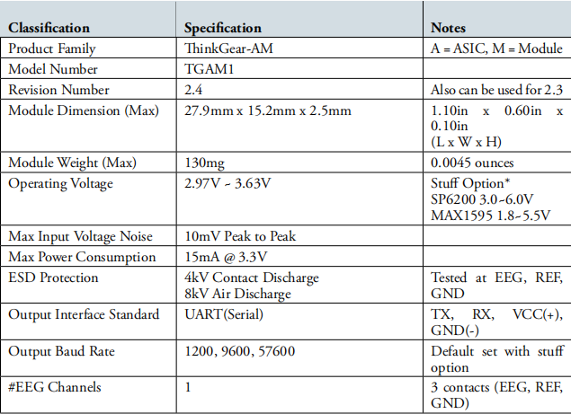
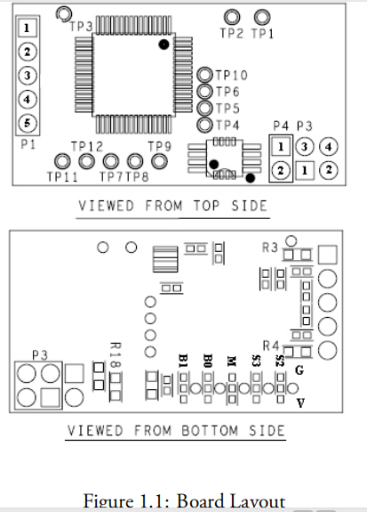
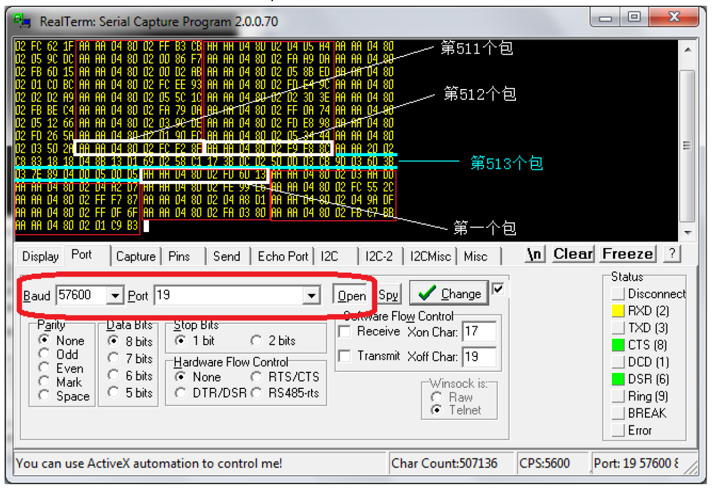

# Outline
1. Prepare 
    - <a href="#Hardware">Hardware
    - [眨眼](#关于眨眼)
```
[TOC]
```

# Prepare

TGAM模块一个

蓝牙模块一个（必须，否则无法获取数据）

# Hardware

The MindSet transmits inkGear Data Values, encoded within inkGear Packets, as a serial stream
of bytes over Bluetooth via a standard Bluetooth Serial Port Proíle (SPP):
• Bluetooth Profile: Serial Port Profile (SPP)
• Baud Rate: 57600
• Authentication key: 0000
Please refer to the MindSet Quick Start Guide and/or MindSet Instruction Manual that accompanied
your MindSet for instructions on how to pair the MindSet to your Windows or Mac computer via
SPP using Bluetooth drivers and Bluetooth stacks available for those platforms. For information on
pairing the MindSet via SPP on other platforms, please refer to your platform's documentation, and
to the SPP specifications that can be found on the Web.

# Technical Specifications

## General 



| Classification | Specification | Notes|
|-------------------- | ------------------ | ---------|
| Product Family | ThinkGear-AM | A = ASIC, M = Module |
| Model Number | TGAM1 |
| Revision Number | 2.4  | Also can be used for 2.3 |
| Module Dimension (Max) | 27.9mm x 15.2mm x 2.5mm | 1.10in x 0.60in x 0.10in <br> (L x W x H) |
| Module Weight (Max) | 130mg | 0.0045 ounces |
| Operating Voltage | 2.97V ~ 3.63V  | Stuff Option* <br>SP6200 3.0~6.0V <br> MAX1595 1.8~5.5V|
| Max Input Voltage Noise | 10mV Peak to Peak |
| Max Power Consumption | 15mA @ 3.3V
| ESD Protection | 4kV Contact Discharge <br> 8kV Air Discharge | Tested at EEG, REF,GND|
| Output Interface Standard | UART(Serial) | TX, RX, VCC(+), GND(-) |
| Output Baud Rate | 1200, 9600, 57600 | Default set with stuff option|
| #EEG Channels | 1 | 3 contacts (EEG, REF, GND)|

## I/O pins 



Header P1 (Electrode)

Pin1: EEG Electrode "EEG"

Pin2: EEG Shield

Pin3: Ground Electrode

Pin4: Reference Shield

Pin5: Reference Electrode "REF"

Header P4 (Power)

Pin1: VCC "+"

Pin2: GND "-"

Header P3 (UART/Serial)

Pin1: GND "-"

Pin2: VCC "+"

Pin3: RXD "R"

Pin4: TXD "T"

Note: Labels in "" indicated on PCB for convenience.

# Serial Communication

This section only outlines parts that are different from the standard ThinkGear API. Please refer to the ThinkGear API and Reference Manual for more details.


## ThinkGear CODE

The code that may appear in the inkGear packets are listed in the following table.

| Code | Length | Value | Default Setting |
| ------- | ----------- | -------- | ---------------------- |
| 0x02 | N/A | Poor Quality (0-200) | On |
| 0x04 | N/A | eSense Attention (0-100) | On |
| 0x05 | N/A | eSense Meditation (0-100) | On |
| 0x80 | 2 | 12-bit Raw EEG | Off |
| 0x83 |24 | EEG Powers (integer) | On |

## Command bytes

The command bytes supported by TGAM1 is listed below.
Page 0 (0000____) (0x0_): STANDARD/ASIC CONFIG COMMANDS* **
00000000 (0x00): 9600 baud, normal output mode
00000001 (0x01): 1200 baud, normal output mode
00000010 (0x02): 57.6k baud, normal+raw output mode

# Configurable Default Settings

TGAM1 has conëguration pads that can be used to change two default settings that are applied at chip power up. e conëguration pads are located on the backside of the TGAM1, as indicated by the red and blue box in Figure 3.1. The BR0 and BR1 pads conëgure the output baud rate and data content, after the TGAM1 powers up. e M pad conëgures the notch ëlter frequency

# Connecting


# Data



TGAM大约每秒钟发送513个包，注意是“大约每秒钟”，意思就是发送包的总数是不会变的，只是发送513个包所花费的时间是一秒左右。
发送的包有小包和大包两种：

## 小包

小包的格式是
```
AA AA 04 80 02 xxHigh xxLow xxCheckSum
```
前面的AA AA 04 80 02 是不变的，后三个字节是一只变化的，xxHigh和xxLow组成了原始数据rawdata，xxCheckSum就是校验和。所以一个小包里面只包含了一个对开发者来说有用的数据，那就是rawdata，可以说一个小包就是一个原始数据，大约每秒钟会有512个原始数据。

那怎么从小包中解析出原始数据呢？
```
rawdata = (xxHigh << 8) | xxLow;
if( rawdata > 32768){
     rawdata =65536; 
}
```
现在原始数据就这么算出来了，但是在算原始数据之前，我们先应该检查校验和。
校验和怎么算呢？
```
sum = ((0x80 + 0x02 + xxHigh + xxLow)^ 0xFFFFFFFF) & 0xFF
```
什么意思呢？
就是把04后面的四个字节加起来，取反，再取低八位。
如果算出来的sum和xxCheckSum是相等的，那说明这个包是正确的，然后再去计算rawdata，否则直接忽略这个包。丢包率在10%以下是不会对最后结果造成影响的。
现在，原始数据出来了，那我们怎么拿信号强度Signal,专注度Attention,放松度Meditation,和8个EEG Power的值呢？
就在第513个这个大包里面，这个大包的格式是相当固定的，我们就拿上图中的数据来一个字节一个字节地说明他们代表的含义：

红色的是不变的

AA 同步

AA 同步

20 是十进制的32，即有32个字节的payload，除掉20本身+两个AA同步+最后校验和

02 代表信号值Signal

C8 信号的值

83 代表EEG Power开始了

18 是十进制的24，说明EEG Power是由24个字节组成的，以下每三个字节为一组

18 Delta 1/3

D4 Delta 2/3

8B Delta 3/3

13 Theta 1/3

D1 Theta 2/3

69 Theta 3/3

02 LowAlpha 1/3

58 LowAlpha 2/3

C1 LowAlpha 3/3

17 HighAlpha 1/3

3B HighAlpha 2/3

DC HighAlpha 3/3

02 LowBeta 1/3

50 LowBeta 2/3

00 LowBeta 3/3

03 HighBeta 1/3

CB HighBeta 2/3

9D HighBeta

03 LowGamma 1/3

6D LowGamma 2/3

3B LowGamma 3/3

03 MiddleGamma 1/3

7E MiddleGamma 2/3

89 MiddleGamma 3/3

04 代表专注度Attention

00 Attention的值(0到100之间)

05 代表放松度Meditation

00 Meditation的值(0到100之间)

D5 校验和

解析EEG Power：
拿Delta举例，Delta 1/3是高字节，Delta 1/3是中字节，Delta 1/3是低字节；
高字节左移16位，中字节左移8位，低字节不变，然后将他们或运算，得到的结果就是Delta的值。
这些值是无符号，没有单位的，只有在和其他的Beta，Gamma等值相互比较时才有意义。

# 关于眨眼
TGAM芯片本身是不会输出眨眼信号的，眨眼是用rawdata原始数据算出来的。表现在原始数据的波形上，眨眼就是一个很大的波峰。只要用代码检测这个波峰的出现，就可以找到眨眼的值了。此外，眨眼其实和脑电波一点儿关系都没有，眨眼只是眼睛动的时候在前额产生的肌（肉）电，混合在了脑波原始数据中。


[Back to Index](#Outline)